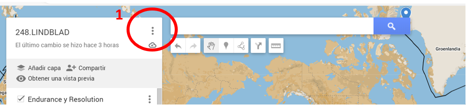
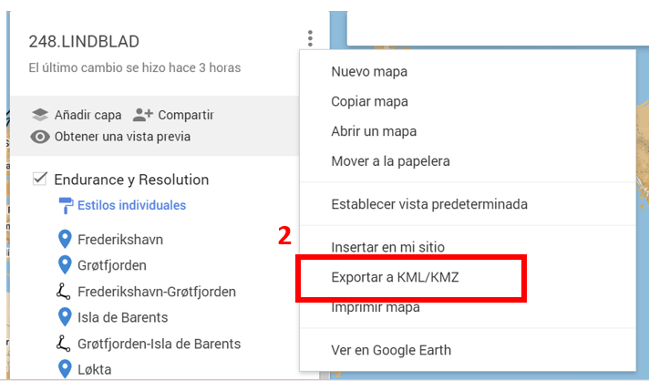
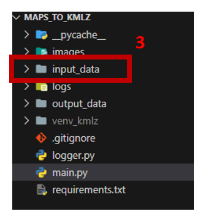

# MAPS_TO_KMLZ Project

## General Overview
This project is designed to parse Keyhole Markup Language (KML) files and transform them into CSV format. It's particularly useful for geographical data processing, enabling the conversion of KML files into a more widely-used format for further analysis or visualization.

## Requirements
- Python 3.12
- Additional Python libraries as specified in `requirements.txt`. To install these, run the command: `pip install -r requirements.txt`.

## Installation
Clone this repository to your local machine. Install the required dependencies as mentioned above.

## Usage
Run `main.py` to start the program. Use the `wrapper` function to parse KML files in the `input_data` directory and output CSVs to the `output_data` directory. 

**IMPORTANT!!!:** Place only ONE file in input_data or specify file name to a single file in the function `warapper` in file main.py. If only one .kml file is placed in `input_data` the code needs NO modification.

## Functions Documentation
The project includes several functions for processing KML files:
- `parse_to_text_to_float`: Converts a list of string numbers into a list of floats.
- `parse_list_float_to_str`: Converts a list of floats into a comma-separated string.
- `parse_kml`: Parses the KML file and extracts points of interest and routes.
- `transform_dict_to_csvs`: Transforms a dictionary into CSV files.
- `wrapper`: A wrapper function to execute the parsing and conversion processes.

## Route preparation
### Prepare your map:

- **Step 1**: Open Google My Maps in your web browser. 
  

- **Step 2**: Create a new map by clicking on the "Create a New Map" button.

- **Step 3**: Use the search tool to find your point of interest, or click directly on the map to place a marker.

- **Step 4**: Customize your marker with a name and description if desired. This name will be used later in your project to reference this point.

- **Step 5**: To draw a line, select the "Draw a line" tool and click on the starting point on the map. Continue clicking at points where you want the line to bend or change direction. Double-click to finish the line.

- **Step 6**: **IMPORTANT!!!** Name your line. This name will be used as the filename for the CSV file generated by your script. Make sure it is descriptive and relevant to the line you've drawn.

### Getting KML File

- **Step 1**: Once you have marked all your points of interest and drawn all necessary lines.

    
- **Setp 2** Save your map and export it as a KML/KMZ file.

  

- **Step 3**: Place the KML/KMZ file in the `input_data` directory of your project to be processed by your script.

  

## Contribution
Any contributioin is  **greatly appreciated**.

## License

